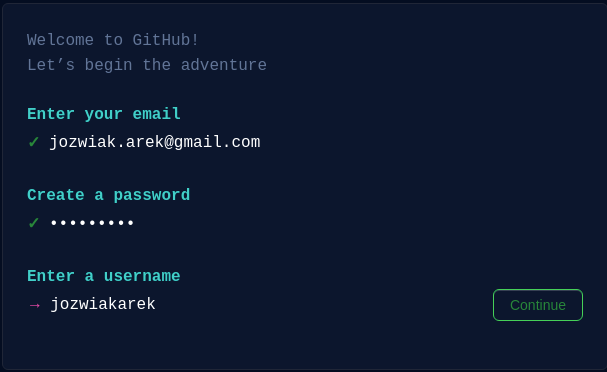
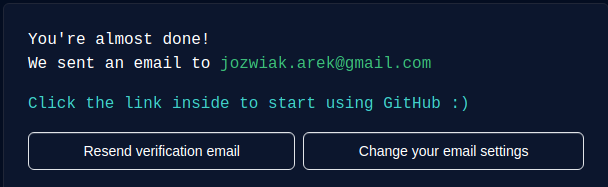
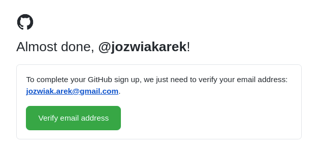

Co to jest system kontroli wersji?

System kontroli wersji (ang. VCS – version control system), jest to oprogramowanie, 
które wspiera programistów podczas pracy nad projektem programistycznym.

Pozwala ono m.in. na sprawdzanie zmian, jakie zostały wykonane oraz cofanie niniejszych modyfikacji.
Dzięki niemu wiemy, kto stoi za daną zmianą i kiedy ją zastosował. 
Modyfikacje mogą zawierać dodatkowe opisy tak, by cel i przyczyna określonych zmian były łatwiejsze do zinterpretowania.

Wyobraź sobie, że chcesz przechowywać różne wersje swojego oprogramowania, 
naturalnym sposobem byłoby stworzenie kopii w oddzielnych, przeznaczonych do tego katalogach. 
Dodatkowo, by mieć większą kontrolę nad wersjami w nazwie dodasz krótki opis. 
Jeżeli chcsz rozszerzać informacje o wprowadzanych zmianach możliwe,
że dodatkowo utworzysz plik tekstowy lub kalkulacyjny exel z dodatkowym opisem.

Takie rozwiązanie jest niestety niepozbawione wad. Z każdą wersją zwiększa się rozmiar 
naszego archiwum i łatwo przy takim podejściu o pomyłkę np. poprzez wprowadzenie zmiany w złym katalogu. 
Cofanie zmian w pojedynczych jest bardzo trudne. 

Jeszcze większa komplikacja następuje wtedy, gdy nad projektem pracuje więcej niż jedna osoba.
W jaki sposób przechowywać odrębie kopie każdego z pracujących przy projekcie programistów oraz
jak łączyć wykonaną przez nich pracę do jednego projektu?

Rozwiązaniem tych problemów są systemy kontroli wersji, 
które pozwalają w łatwy sposób zapisywać poszczególne wersje projektu. 
Mamy możliwość przeglądania historii zmian, sprawdzać kto i kiedy jaką modyfikację zastosował.

Programiści, tworząc aplikację, dokonują ciągłych zmian w jej kodzie oraz publikują jej nowe wersje.
Dzięki dodatkowym mechanizmom, możemy łączyć zmiany, wykonywane przez wielu programistów w jedną całość.

Na kursie zapoznamy się z systemem kontroli wersji git, który udostępniany jest m.in. przez portal github.com.
GitHub jest serwisem internetowym, przeznaczonym dla projektów programistycznych, wykorzystujących system kontroli wersji git.

Umożliwia on tworzenie repozytoriów z kodem, czyli w praktyce, katalogów z projektem.
W ramach serwisu github.com możemy tworzyć repozytoria publiczne, co oznacza, że ich zawartość jest dostępna publicznie.
Innym typem są repozytoria prywatne — te wymagają praw dostępu, które samodzielnie jesteśmy w stanie zdefiniować.

Git nie jest jedynym systemem tego typu, ale zdecydowanie najpopularniejszym. 

Istnieją również alternatywy dla github.com, czyli serwisy takie jak: bitbucket.com czy gitlab.com.
 
I tu, ponownie github.com jest najpopularniejszym z nich.

Podczas kursu, w serwisie GitHub będą Ci udostępniane zadania oraz egzaminy. 
Pierwszą styczność z serwisem będziesz mieć już podczas wykonywania zadań przygotowujących, czyli preworku.

W rzeczywistych projektach programistycznych serwis GitHub jest wykorzystywany jako miejsce przechowywania źródła kodu.

Zaczniemy od utworzenia konta w serwisie GitHub, w tym celu odwiedzamy stronę github.com.
Z prawego górnego rogu wybieramy opcję Sign up. 

W następnym kroku podajemy adres email, hasło oraz nazwę użytkownika:

Ostatnim krokiem będzie potwierdzenie adresu email, poprzez kliknięcie linku z wiadomości.

Poniżej przykład takiej wiadomości:

Gratulacje! Właśnie prawidłowo utworzyłeś konto w serwisie GitHub.
