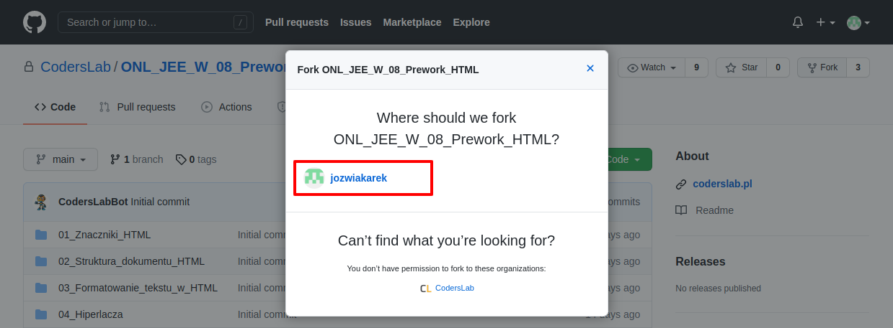

## Jak pobrać repozytorium na komputer

Zanim pobierzemy repozytorium lokalnie w pierwszej kolejności tworzymy **fork**.
W tym celu będąc na stronie repozytorium wybieramy opcję:


następnie wybieramy konto GitHub na jakie mamy dokonać forka.


Po zatwierdzeniu konta, zostaniemy autoamtycznie przekierowani do nowego repozytorium.
To na co należy zwrócić uwagę to zmiana adresu względem początkowego.

Początkowe repozytorium miało adres:
```https://github.com/CodersLab/ONL_JEE_W_08_Prework_HTML```
nasz adres repozytorium po wykonaniu forka będzie zawierał nazwę konta na github, np:
```https://github.com/jozwiakarek/ONL_JEE_W_08_Prework_HTML```

Z tak wykonanego forka możemy pobrać repozytorium bezpośrednio na nasz komputer.
W dalszej części artykułu znajdziesz więcej informacji czym jest fork.
 
### Weryfikacja instalacji git.

W ramach kursów Java oraz python udostępniany jest skrypt instalacyjny, 
który zawiera odpowiednie komendy instalujące oprogramowanie git.
Dla pewności zweryfikuj czy git jest poprawnie zainstalowany na Twoim komputerze.
W tym celu otwórz terminal, a następnie wpisz polecenie:
```bash
git --version
```
Jeżeli w odpowiedzi dostaniemy komunikat podobny do poniższego (mogą być różne oznaczenia numeryczne):
```bash
git version 2.25.1
```
oznacza to, że mamy poprawnie zainstalowanego gita na komputerze.
W przeciwnym wypadku wykonaj instrukcję instalacji:
[https://git-scm.com/book/en/v2/Getting-Started-Installing-Git](https://git-scm.com/book/en/v2/Getting-Started-Installing-Git)

### Pobieranie repozytorium lokalnie
Po weryfikacji poprawności instalacji gita w naszym systemie oraz utworzeniu forka 
przechodzimy do pobrania repozytorium bezpośrednio na nasz komputer.
W tym celu otwieramy terminal, następnie wpisujemy polecenie:


#### Screencast 


### Czym jest fork

Fork — jest kopią repozytorium, którą możemy samodzielnie utworzyć zgodnie z powyższym opisem.
Tworzymy tym sposobem własną niezależną wersję innego repozytorium, którym możemy dowolnie zarządzać.
Najczęściej są wykorzystywane, gdy chcemy wykorzystać jakiś projekt jako punkt startowy dla własnego.
Dzięki nim możemy również zaproponować wprowadzenie jakiejś zmiany do innego projektu.


Więcej na temat forków dowiemy się tutaj:
[https://docs.github.com/en/github/getting-started-with-github/quickstart/fork-a-repo](https://docs.github.com/en/github/getting-started-with-github/quickstart/fork-a-repo)
[https://guides.github.com/activities/forking/](https://guides.github.com/activities/forking/)
